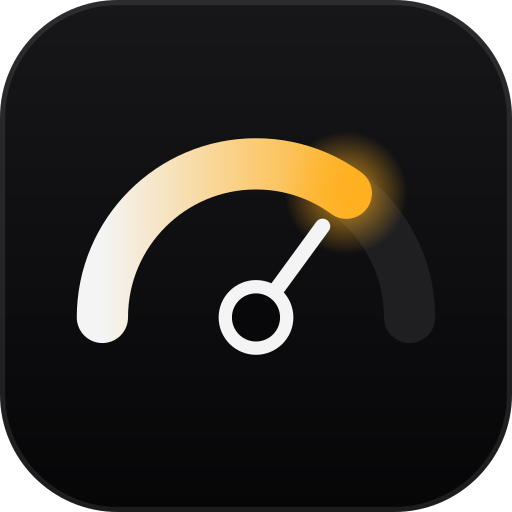
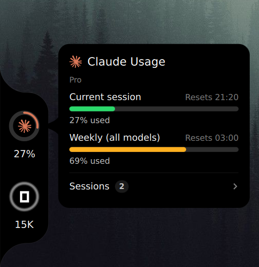
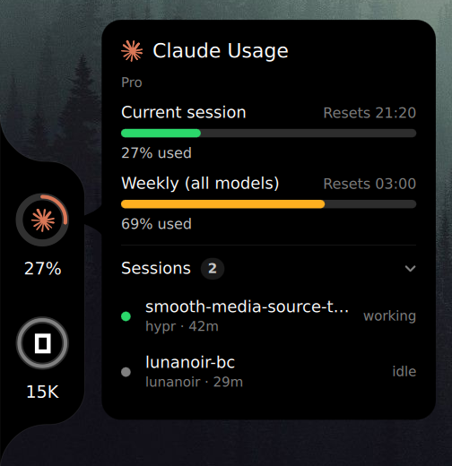

<p align="center"></p>

# flare

A usage notch for Quickshell on Hyprland: how much of your Claude Code, Codex,
Cursor, OpenCode, Antigravity and Kiro allowance is left, welded to the edge of the
screen.

[Website](https://lunanoir21.github.io/flare-notch/) · [Türkçe README](README.tr.md)

<p align="center">
  
  
</p>

## Three looks

| Style | What it is |
|---|---|
| **classic** | Codenotch's notch. A black body with inverse rounded corners on the left or right edge, one ring per provider. Hover a ring for the detail card; click it to open that provider's usage page. |
| **aura** | One provider at a time, tinted with its colour. The others wait below as a logo and a number. Tap one, or bind Super + ← / → to the `next` / `prev` IPC calls (see Keybinds). |
| **compact** | A thin strip on the top or bottom edge. One tap grows it into a panel with a row per provider; another tap closes it. |

Each style meets the edge one of three ways, as in Quay: **bridge**, the default,
welds it to the edge with inverse rounded corners; **floating** holds it off the edge
as a rounded panel; **flush** runs a strip along the whole edge that flares into the
screen at both ends.

It can also stay out of the way: with `notch.reveal = "hover"` it waits tucked past the
edge and slides in when the pointer reaches it, and with `"shortcut"` a key brings it
in and sends it away.

Providers you don't use can be switched off in the settings page, and a provider that
is not installed never gets a cell.

Rings go green under 50 %, yellow under 70 %, orange above; the hover card's bars go
green, orange and red the same way. A reading flare could not refresh is dimmed,
never invented.

Right-click the widget for its settings page, or open **flare** from your app launcher.
Drag the widget along its edge to move it.

## Open sessions

The hover card also lists the Claude Code sessions running right now, folded under a
**Sessions** header: click the header (or bind the `toggleSessions` IPC call) to open
it. Each row shows the session's name, its project, how long it has been open and
whether it is working, waiting on you or idle. Click a row to bring its terminal to
the front.

The list comes from the records Claude Code itself keeps in
`~/.claude/sessions/<pid>.json`. A record whose process has exited, or whose pid now
belongs to another process, is skipped. On Hyprland a session also needs a window:
one kept alive by a host whose window is closed — Orca's terminal daemon, say — is as
good as closed, so it is not listed. The same jump works from a terminal:

```sh
flare focus <pid>      # pid as listed under "sessions" in flare's JSON
```

Jumping to a session and hiding windowless ones use `hyprctl`; on another compositor
the list still shows, without either.

In kitty, the jump can also bring the session's tab (or split) to the front. That
needs kitty's remote control on a socket, which lets any program running as you
control kitty, so it is left to you. In `kitty.conf`:

```
allow_remote_control socket-only
listen_on unix:@kitty
```

Without it, flare brings the kitty window forward and leaves the tab as it is.

## Notifications

`flare watch` is a long-running process the widget starts on its own, only while at
least one notification is switched on in `[notify]`:

- a session stops and waits on you — the notification's action jumps to it
- a limit reaches `notify.limit_at` percent (once per limit period)
- a limit you had been using resets

It sends these with `notify-send` and needs nothing else running. `sessions.show`
turns the card's session list off entirely, if you'd rather not see it at all.

## The usage panel

Click the arrow at the top of a provider's hover card, or `qs ipc call flare usage
<provider>`, for the full picture: an hour-by-hour heatmap of its busiest limit's
current week, or the last seven days for a provider with no limit (token counts —
credits for Kiro — read straight from the provider's own logs, each reply counted
once), the busiest hours and quietest day, and today's sessions on a timeline —
click an open Claude Code one to jump to its terminal. OpenCode, Antigravity and
Kiro sessions come from their own history, closed ones included.

Pick a provider from the cards across the top (or with ← / →); the rest scrolls.
Further down: each limit with how much of its time has gone and where today's pace
takes it, how the longest limit filled, the last seven days, the hours of the day,
the models that took the most, and the week's sessions.

## Where the numbers come from

`data.mode` picks one of two ways.

**official** (default) reads each provider the way Codenotch does:

| Provider | Source |
|---|---|
| Claude Code | `GET api.anthropic.com/api/oauth/usage` with the token Claude Code keeps in `~/.claude/.credentials.json`. An expired token is never sent; it is renewed shortly before expiry by running `claude -p`. A 429 backs off from one minute to fifteen, and the deadline survives restarts. Where the endpoint cannot answer, a fresh status line capture stands in. |
| Codex | `GET chatgpt.com/backend-api/wham/usage` with the session in `~/.codex/auth.json`, falling back to the limits Codex wrote into its newest rollout log. |
| Cursor | `GET cursor.com/api/usage-summary` with the editor's own session from `~/.config/Cursor/User/globalStorage/state.vscdb`. Reading this is the one case where official mode borrows more than a stored token — a live session cookie — so the widget asks once before ever doing it; declining leaves Cursor out of official mode until `data.cursor_consent` is changed. |
| OpenCode | Its local database. OpenCode runs on your own API keys, so it shows tokens today rather than a limit. |
| Antigravity | Each model group's quota (Gemini, and other models) and its refill time, from the status line capture (below): agy keeps quotas in memory only. Tokens and the models used come from the per-conversation databases in `~/.gemini/antigravity-cli/conversations`. |
| Kiro | `GET q.<region>.amazonaws.com/getUsageLimits` with the sign-in `kiro-cli` keeps in `~/.local/share/kiro-cli/data.sqlite3`: the month's credits, shown as credits left, and when they refill. The sign-in lives an hour and is renewed shortly before it runs out by running `kiro-cli whoami`. Credits per request come from `~/.kiro/sessions/cli`. |

**local** never opens a network connection. Claude comes from the status line
capture (below), Codex from its rollout logs, OpenCode and Antigravity from their
own files as in official mode, Kiro from its session files (credits today, no
allowance). Cursor
keeps no usage on disk, so it shows nothing in this mode.

Credentials are read, never written, and never printed: `flare doctor` describes a
token by its length. Network reads keep their own pace — Claude every minute, Codex,
Cursor and Kiro every five — however often the widget refreshes.

Renewing Claude's token runs `claude -p`, found by searching `PATH` and then a fixed
list of well-known install directories — the same trust any shell's own `PATH` lookup
already carries, but if that is more than you want, set `claude.binary_path` to pin
the exact one to run.

## Install

Requires Quickshell 0.3+ and Qt 6.6+.

```sh
git clone https://github.com/lunanoir21/flare-notch
cd flare-notch
./install.sh
```

`install.sh` builds the `flare` binary when Rust 1.85+ is installed and otherwise
downloads the [latest release](https://github.com/lunanoir21/flare-notch/releases/latest)'s
build (x86_64, glibc 2.39+), puts it in `~/.local/bin` (`FLARE_BIN_DIR` to change
that) and runs `flare doctor`.

It also adds **flare** to your app launcher (rofi, wofi, fuzzel and the like): a
`flare.desktop` entry and its icon under `~/.local/share`, and `flare-settings` next to
the binary. Opening it brings up the settings page in whichever running Quickshell has
flare loaded, and starts the widget on its own first when none does.

By hand, `cargo build --release` is enough: the widget finds the binary it was built
next to, as well as one on `PATH` or in `~/.local/bin`, or the one
`flare.binary_path` names.

### Run it on its own

```sh
quickshell -p ui
```

### Or inside your shell

```qml
import "path/to/flare-notch/ui" as Flare

ShellRoot {
    Flare.FlareHost {}
}
```

### Claude in local mode: the status line capture

Claude Code keeps its 5-hour and weekly percentages in memory and hands them only to
its status line command. `hooks/claude-statusline-capture.sh` writes that payload to
`~/.local/state/flare/` and passes it on unchanged. Put it in front of whatever you
already use, in `~/.claude/settings.json`:

```json
"statusLine": {
  "type": "command",
  "command": "/path/to/flare-notch/hooks/claude-statusline-capture.sh npx -y @owloops/claude-powerline@latest"
}
```

Official mode does not need it, but uses a fresh capture when the endpoint is down.

### Antigravity's quotas: its status line capture

agy hands each model group's quota only to its status line command.
`hooks/agy-statusline-capture.sh` saves it the same way; point agy at it in
`~/.gemini/antigravity-cli/settings.json`, keeping agy's own line with
`stack_with_default`:

```json
"statusLine": {
  "command": "/path/to/flare-notch/hooks/agy-statusline-capture.sh",
  "enabled": true,
  "stack_with_default": true
}
```

The quotas then refresh every time agy runs; between runs the last ones stand.

## Configuration

Everything lives in `~/.config/flare/config.toml`. The settings page writes the same
file, through the same command a terminal uses:

```sh
flare config init                      # a commented file with every default
flare config set notch.style aura
flare config set notch.edge right
flare config set providers.order claude,cursor,codex,opencode
flare config set aura.claude "#E07A5F"
flare config set data.mode local
flare config get                       # the effective config, as JSON
```

`set` refuses unknown keys and values a key cannot hold, and keeps the file's
comments. The widget picks up a saved change within a second.

| Key | Values |
|---|---|
| `data.mode` | `official`, `local` |
| `data.cursor_consent` | `unset`, `granted`, `declined` |
| `theme.mode` | `black`, `white`, `auto` |
| `theme.ring_color` | `monochrome`, `provider` |
| `ui.language` | `auto` (the locale), `en`, `tr` |
| `notch.style` | `classic`, `aura`, `compact` |
| `notch.mount` | `bridge`, `floating`, `flush` |
| `notch.gap` | floating: pixels off the edge, `0` to `64` |
| `notch.reveal` | `always`, `hover`, `shortcut` |
| `notch.reveal_delay_ms`, `notch.hide_delay_ms` | hover: `0` to `5000` |
| `notch.edge` | `left`, `right` |
| `notch.offset` | pixels from the centre, along the edge |
| `notch.scale` | `0.5` to `2.0` |
| `notch.screen` | output name, or empty for every screen |
| `notch.label` | under a ring: `percent` (used), `time` (until it resets), `both` |
| `compact.edge` | `top`, `bottom` |
| `compact.offset` | pixels from the centre, along the edge |
| `compact.open_on` | `click`, `hover` |
| `providers.claude`, `.codex`, `.cursor`, `.opencode`, `.antigravity`, `.kiro` | `true`, `false` |
| `providers.order` | the order cells are drawn and aura steps through |
| `sessions.show` | `true`, `false` — the hover card's session list |
| `usage.all_providers` | `true`, `false` — also list (and read) switched-off providers in the usage panel |
| `notify.waiting`, `notify.limit`, `notify.reset` | `true`, `false` |
| `notify.limit_at` | `50` to `100` |
| `aura.claude` … `aura.kiro` (one per provider) | `#RRGGBB` |
| `poll.interval_secs` | widget refresh, at least 5 |
| `scan.window_days` | days of logs counted toward token (and credit) totals |
| `claude.binary_path`, `kiro.binary_path`, `opencode.binary_path`, `codex.binary_path`, `flare.binary_path` | pin a program instead of searching `PATH` |

## Keybinds

flare listens on Quickshell IPC as `flare`:

| Call | Does |
|---|---|
| `next`, `prev` | step aura to the next or previous provider |
| `toggle` | open or close the compact panel |
| `toggleVisible`, `show`, `hide` | bring the widget in or tuck it away (hover and shortcut reveal) |
| `toggleSessions` | open or fold the hover card's session list |
| `card <provider>` | open the hover card for a provider without the pointer, bringing the notch in; again to close |
| `usage <provider>` | open the usage panel on a provider; again to close |
| `style classic\|aura\|compact` | switch style |
| `settings` | open or close the settings page |
| `openSettings` | open the settings page, leaving it open if it already is |
| `refresh` | read now |

For Hyprland, with flare inside the shell at `~/.config/quickshell/shell.qml`:

```ini
bind = SUPER, right, exec, qs ipc call flare next
bind = SUPER, left,  exec, qs ipc call flare prev
bind = SUPER, U,     exec, qs ipc call flare toggle
bind = SUPER SHIFT, U, exec, qs ipc call flare toggleVisible
```

Add `-p /path/to/shell.qml` after `qs` when your shell lives elsewhere.

## Credit where it is due

flare exists because of [Codenotch](https://github.com/vinzdg/codenotch) by Vinz. The
notch itself — its shape, its rings and colours, the hover card, the rule that a
reading is never invented — is Codenotch's design, and the way flare reads each
provider follows Codenotch's providers. Codenotch also showed what it takes to bring
the idea to a desktop that is not a Mac, which is the whole of what flare tries to do
for Hyprland. No Swift code was copied; the Rust here was written against the
behaviour Codenotch documents.

[Codenotch for Windows](https://github.com/Im-Midi/codenotch-windows) by Im-Midi wrote
those provider semantics down in portable Rust, which made the Linux reading of every
wire format far less of a guess.

Local mode's technique — reading what each agent already wrote to disk — comes from
[Orca](https://github.com/stablyai/orca), and the wish to see AI usage at a glance
from [CodexBar](https://github.com/steipete/CodexBar).

Provider logos are from [LobeHub Icons](https://github.com/lobehub/lobe-icons) (MIT);
see `ui/assets/logos/NOTICE.md`. The logos are trademarks of their owners.

## License

MIT — see `LICENSE`.
